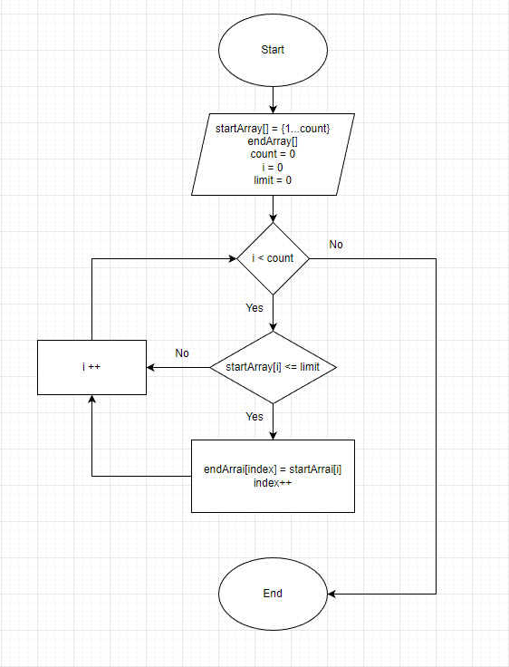

# Итоговое задание
## Условие задачи:
Написать программу, которая из имеющегося массива строк формирует массив из строк, длинна которых меньше или равна 3 символам. Первоначальный массив можно ввести с клавиатуры, либо задать на старте выполнения алгоритма.

## Решение:
1. Пользователю предложенно создать массив, предварительно спросив у него о колличестве вводимых значений. Создаем метод заполнения массива.
2. Создаем метод перебирающий значения массива с переменной, которую будем увеличивать при нахождении условий удовлетворяющих поиску.
3. Создаем новый массив из полученных данных. Создаем метод  вывода массива на экран.
4. Если пользователь не ввел на первоначальном этапе данные или они равны нулю, выводится сообщение "Массив не имеет значений".

## Блок схема к данной задаче

